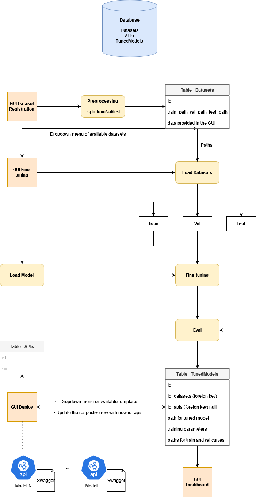
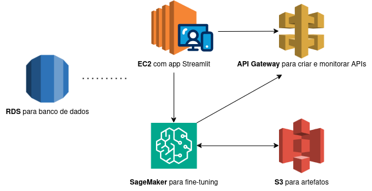

# Mini GenPlat - Fine-tuning e Deploy de LLMs

## Instalação e uso

Este projeto tem o intuito de construir uma mini plataforma de IA Generativa, chamada de _Mini GenPlat_.<br>
Para instalar a plataforma basta construir e iniciar a imagem Docker, conforme o código abaixo, e acessá-la por um browser local pelo endereço `http://0.0.0.0:8501`:
```bash
docker build -t mini-genplat .
docker run --network host mini-genplat
```

A interface consiste de uma aplicação construída com Streamlit. Ao abrir a plataforma é possível ver à esquerda abas que representam um pequeno pipeline de Machine Learning. Para fazer um teste completo recomenda-se seguir a sequência orientada:
1. Na aba `Registro de Datasets` digite o path para seu dataset, que deve estar dentro da pasta `datasets/`, ou utilize o `datasets/example_dataset.csv`, um pequeno dataset montado a partir do dataset [JFLEG](https://huggingface.co/datasets/jhu-clsp/jfleg). Este projeto foca em tarefas de IA Generativa do tipo _text-to-text_, portanto o dataset deve ser um .csv contendo os campos `text` e `target`, ambos textuais. Entre também com outros dados relevantes sobre o dataset e clique em `Salvar`.
2. Na aba `Fine-tuning` você pode escolher algumas configurações para seu fine-tuning. Atualmente a plataforma suporta alguns modelos da família [`T5`](https://huggingface.co/google-t5), em suas versões _small_ e _base_. Escolha um dos datasets que registrou, e em seguida escolha a opção de fine-tuning, `Clássico` ou utilizando _Low-Rank Adaptation_ (`LoRA`). No caso da opção LoRA o parâmetro para escolha do ranking de matriz será apresentado. Por fim, escolha um learning rate e clique em `Fine-tune`.
3. Após o fine-tuning um modelo fica disponível para `Deploy`. Nesta aba, basta escolher qual modelo deseja deployar e clicar no botão de `Deploy`.
4. Na aba `Dashboard` você pode visualizar maiores detalhes sobre os modelos que foram deployados, como por exemplo nome, ID no banco de dados, dataset e parâmetros usados no fine-tuning, URI da API e o link para sua documentação Swagger. Além disso, também é possível visualizar as curvas de loss dos sets de treino e validação usados no fine-tuning.

## Características relativas à IA Generativa

- A opção de fine-tuning com LoRA (_Low-Rank Adaptation_) possibilita trabalhar com modelos maiores, como os típicos LLMs. A técnica consiste em reduzir o número de parâmetros a serem treinados ao mesmo tempo que tenta manter os desempenhos a serem obtidos no tuning.
- Os modelos são deployados em APIs que utilizam Python _async_, de forma que operações custosas (como a inferência de modelos generativos) não gerem grandes bloqueios aos usuários.

## Pontos de melhoria e trabalhos futuros

- A solução atual apenas permite o uso de modelos da família T5, através da biblioteca Hugging Face. Pretende-se implementar uma biblioteca de modelos, registrando seus respectivos dados essenciais para execução, como tokenizador e loader;
- O monitoramento da etapa de fine-tuning pode ser feito apenas pelo terminal de onde a execução do docker foi disparada. Pretende-se integrar este monitoramento diretamente na aba de fine-tuning;
- No projeto atual é necessário incluir os datasets na pasta `datasets/` para que eles estejam na construção do Docker. O ideal seria mapear datasets externos ao docker com alguma aplicação;
- Existem alguns poucos campos disponíveis para configuração de fine-tuning, uma vez que o foco principal foi em construir todo o pipeline em si. No futuro pretende-se adicionar os mais diversos campos possíveis;
- Estuda-se a possibilidade de implementar uma API orquestradora, que receberia as requisições principais e as direcionaria às respectivas APIs com modelos deployados.

## Arquitetura Original

<p align="center">
  
</p>

## Proposta de Arquitetura AWS

- Um **RDS** seria utilizado para lidar com a questão do banco de dados
- A instância **EC2** atuaria como ponto de integração do projeto, contendo o endpoint da interface Streamlit e disparando etapas do pipeline
- O **SageMaker** seria utilizado para fazer o pequeno processamento de dados, executar o fine-tuning de modelos, e gerar os endpoints/deploys destes modelos. Também atuaria em parte do monitoramento dos modelos deployados, a nível de questões de desempenho e acurácia, e estaria em constante comunicação com buckets **S3** para armazenar artefatos, como por exemplo os pesos dos modelos
- Os modelos deployados com **SageMaker** seriam integrados com a solução **API Gateway**, que seria responsável por lidar com questões relacionadas à disponibilização geral de APIs (e.g. segurança, direcionamento). A **API Gateway** também seria responsável por parte do monitoramento de APIs (e.g. registro de números e endereços de requisições)

<p align="center">
  
</p>
