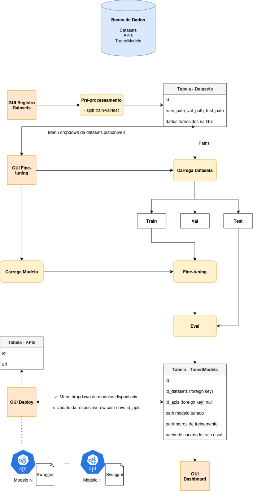

# Mini GenPlat - Fine-tuning e Deploy de LLMs

Este projeto tem o intuito de construir uma mini plataforma de IA Generativa, chamada de _Mini GenPlat_.<br>
Para instalar a plataforma basta construir e iniciar a imagem Docker, conforme o código abaixo, e acessá-la por um browser local pelo endereço `http://0.0.0.0:8501`:
```bash
docker build -t mini-genplat .
docker run --network host mini-genplat
```

Ao abrir a plataforma é possível ver à esquerda abas que representam um pequeno pipeline de Machine Learning. Para fazer um teste completo recomenda-se seguir a sequência orientada:
1. Na aba `Registro de Datasets` digite o path para seu dataset, ou utilize o `example_dataset.csv`, um pequeno dataset montado a partir do dataset [JFLEG](https://huggingface.co/datasets/jhu-clsp/jfleg). Este projeto foca em tarefas de de IA Generativa do tipo _text-to-text_, portanto o dataset deve ser um .csv contendo os campos `text` e `target`, ambos textuais. Entre também com outros dados relevantes sobre o dataset e clique em `Salvar`.
2. Na aba `Fine-tuning` você pode escolher algumas configurações para seu fine-tuning. Atualmente a plataforma suporta alguns modelos da família [`T5`](https://huggingface.co/google-t5), em suas versões _small_ e _base_. Escolha um dos datasets que registrou, e em seguida escolha a opção de fine-tuning, `Clássico` ou utilizando _Low-Rank Adaptation_ (`LoRA`). No caso da opção LoRA o parâmetro para escolha do ranking de matriz será apresentado. Por fim, escolha um learning rate e clique em `Fine-tune`.
3. Após o fine-tuning um modelo fica disponível para `Deploy`. Nesta aba, basta escolher qual modelo deseja deployar e clicar no botão de `Deploy`.
4. Na aba `Dashboard` você pode visualizar maiores detalhes sobre os modelos que foram deployados, como por exemplo nome, ID no banco de dados, dataset e parâmetros usados no fine-tuning, URI da API e o link para sua documentação Swagger. Além disso, também é possível visualizar as curvas de loss dos sets de treino e validação usados no fine-tuning.

O diagrama abaixo representa a arquitetura do projeto.

<br>
<p align="center">
  
</p>