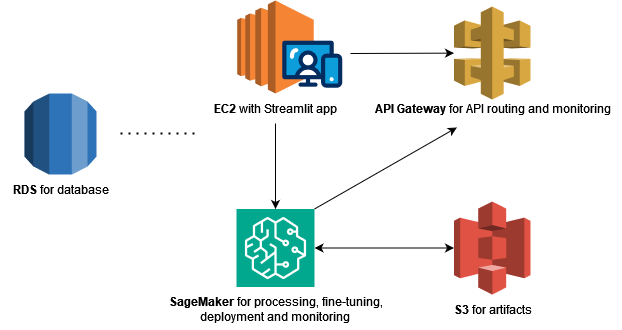

# Mini GenPlat - Fine-tuning and Deployment of LLMs

## Installation and use

This project aims to build a mini Generative AI platform, called _Mini GenPlat_.<br>
To install the platform, simply build and start the Docker image, according to the code below, and access it through a local browser at the address `http://0.0.0.0:8501`:
```bash
docker build -t mini-genplat .
docker run --network host mini-genplat
```

The interface consists of an application built with Streamlit. When opening the platform, you can see tabs on the left that represent a small Machine Learning pipeline. To perform a complete test, it is recommended to follow this sequence:
1. In the `Dataset Registration` tab, enter the path to your dataset, which must be inside the `datasets/` folder, or use `datasets/example_dataset.csv`, a small dataset assembled from the [JFLEG](https://huggingface.co/datasets/jhu-clsp/jfleg) dataset. This project focuses on _text-to-text_ Generative AI tasks, so the dataset must be a .csv containing the `text` and `target` fields, both textual. Also enter other relevant data about the dataset and click `Save`.
2. In the `Fine-tuning` tab, you can choose some settings for your fine-tuning. Currently, the platform supports some models from the [`T5`](https://huggingface.co/google-t5) family, in their _small_ and _base_ versions. Choose one of the datasets you registered, and then choose the fine-tuning option, `Classic` or using _Low-Rank Adaptation_ (`LoRA`). In the case of the LoRA option, the parameter for choosing the matrix ranking will be presented. Finally, choose a learning rate and click `Fine-tune`.
3. After fine-tuning, a model becomes available for `Deploy`. In this tab, simply choose which model you want to deploy and click the `Deploy` button.
4. In the `Dashboard` tab, you can view more details about the models that were deployed, such as name, ID in the database, dataset and parameters used in fine-tuning, API URI and the link to its Swagger documentation. In addition, it is also possible to view the loss curves of the training and validation sets used in fine-tuning.

## Generative AI-related features

- The fine-tuning option with LoRA (_Low-Rank Adaptation_) makes it possible to work with larger models, such as typical LLMs. The technique consists of reducing the number of parameters to be trained while trying to maintain the performances to be obtained in the tuning.

- The models are deployed in APIs that use Python _async_, so that expensive operations (such as the inference of generative models) do not generate large blockages for users.

## Points for improvement and future work

- The current solution only allows the use of models from the T5 family, through the Hugging Face library. The intention is to implement a library of models, recording their respective essential data for execution, such as tokenizer and loader;
- The monitoring of the fine-tuning stage can only be done through the terminal from which the docker execution was triggered. The intention is to integrate this monitoring directly into the fine-tuning tab; 
- In the current project, it is necessary to include the datasets in the `datasets/` folder so that they are included in the Docker build. The ideal would be to map datasets external to Docker with some application;
- There are a few fields available for fine-tuning configuration, since the main focus was on building the entire pipeline itself. In the future, it is intended to add as many fields as possible;
- The possibility of implementing an orchestrator API, which would receive the main requests and direct them to the respective APIs with deployed models, is being studied.

## Original Architecture

<p align="center">

</p>

## AWS Architecture Proposal

This is a proposal of how this architecture would be implemented on AWS:
- An **RDS** would be used to handle the database part
- The **EC2** instance would act as the project's integration point, containing the Streamlit interface endpoint and triggering pipeline steps
- **SageMaker** would be used to perform small data processing, perform model fine-tuning, and generate endpoints/deploys for these models. It would also act in part of the monitoring of deployed models, in terms of performance and accuracy, and would be in constant communication with **S3** buckets to store artifacts, such as model weights
- The models deployed with **SageMaker** would be integrated with the **API Gateway** solution, which would be responsible for dealing with issues related to the general availability of APIs (e.g. security, routing). The **API Gateway** would also be responsible for some of the API monitoring (e.g. recording request numbers and addresses)

<p align="center">

</p>